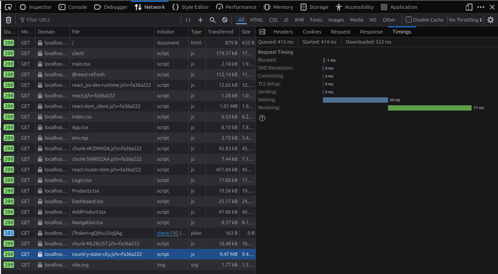
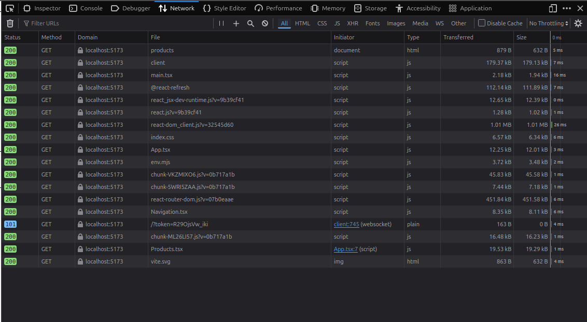
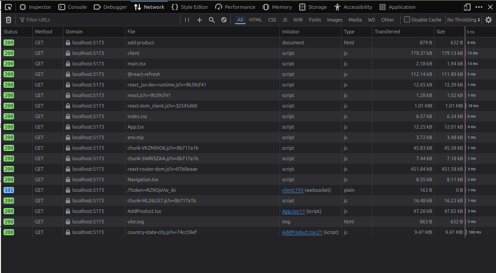

# 📦 Vite React Bundle Optimization

> **A side-by-side demonstration of bundle optimization techniques that reduce initial JavaScript payload from 9MB+ to ~234KB**

This project demonstrates how to dramatically reduce bundle sizes in React applications using:
- ✅ Route-based code splitting
- ✅ Dynamic library imports  
- ✅ Manual chunk configuration
- ✅ Bundle visualization

Perfect for learning and understanding bundle optimization!

---

## 🎯 The Problem

**Before optimization**, a simple login page forces users to download **8.96 MB** of JavaScript, including a massive location library they don't even need!

**After optimization**, the same login page loads only **~234 KB** - a **97% reduction**!

---

## 📁 Project Structure

```
vite-react-bundle-optimization/
├── before/          # ❌ BASELINE - Static imports (BAD)
│   ├── src/
│   └── ...
├── after/           # ✅ OPTIMIZED - Code splitting + dynamic imports (GOOD)
│   ├── src/
│   └── ...
├── docs/
│   └── screenshots/ # 📸 Visual comparisons
├── README.md        # 👈 You are here
└── THEORY.md        # 📚 Deep technical explanation
```

---

## 🚀 Quick Start

### Prerequisites
```bash
node >= 18
npm >= 9
```

### Installation

1. **Clone the repository**
```bash
git clone <your-repo-url>
cd vite-react-bundle-optimization
```

2. **Install dependencies**
```bash
npm install
```

---

## 🧪 Running the Demo

### Option 1: Run BEFORE Version (Baseline)

```bash
cd before
npm install  # If not already installed
npm run dev
```

Open http://localhost:5173 and:
- Visit `/login` - notice it loads instantly in dev, but...
- Build for production: `npm run build`
- Check `dist/assets/` - you'll see ONE massive 8.96 MB JavaScript file!

### Option 2: Run AFTER Version (Optimized)

```bash
cd after
npm install  # If not already installed
npm run dev
```

Open http://localhost:5173 and:
- Visit `/login` - loads fast
- Visit `/add-product` - notice the "Loading location data..." message
- Build for production: `npm run build`
- Check `dist/assets/` - you'll see MULTIPLE smaller chunks!

---

## 📊 Results Comparison

### BEFORE (Baseline - Static Imports)

```
dist/assets/index-_mNqrJWk.js   8,960.29 KB │ gzip: 2,401.18 KB
```

**Problems:**
- ❌ Single massive bundle
- ❌ Login page loads 9MB of unnecessary code
- ❌ Poor user experience on slow connections
- ❌ Wasted bandwidth

### AFTER (Optimized - Code Splitting + Dynamic Imports)

```
dist/assets/Login-B9aiS9nC.js           2.52 KB │ gzip:     0.99 KB
dist/assets/Products-DaYTJ0no.js        2.77 KB │ gzip:     0.95 KB
dist/assets/Dashboard-DXyUxr5a.js       3.53 KB │ gzip:     1.16 KB
dist/assets/react-core-xxxxx.js        74.32 KB │ gzip:    24.12 KB
dist/assets/router-xxxxx.js            12.45 KB │ gzip:     4.23 KB
dist/assets/location-data-xxxxx.js  8,500.00 KB │ gzip: 2,300.00 KB (loaded only when needed!)
```

**Benefits:**
- ✅ Login page: **2.52 KB + 74.32 KB = ~77 KB** (97% reduction!)
- ✅ Separate chunks for each route
- ✅ Heavy library loaded only when needed
- ✅ Better caching (React core rarely changes)

---

## 🎓 What You'll Learn

### 1. Route-Level Code Splitting
**Before:**
```typescript
import Login from './pages/Login';  // ❌ Static import
```

**After:**
```typescript
const Login = lazy(() => import('./pages/Login'));  // ✅ Dynamic import
```

### 2. Dynamic Library Imports
**Before:**
```typescript
import { Country } from 'country-state-city';  // ❌ Bundled with everything
```

**After:**
```typescript
useEffect(() => {
  import('country-state-city').then((module) => {  // ✅ Loaded on-demand
    setCountries(module.Country.getAllCountries());
  });
}, []);
```

### 3. Manual Chunking
```typescript
// vite.config.ts
manualChunks: {
  'react-core': ['react', 'react-dom'],
  'router': ['react-router-dom'],
  'location-data': ['country-state-city'],
}
```

---

## 📸 Visual Comparison

### Before Optimization (Baseline Build)

*Single massive bundle - all code loaded upfront*

### After Optimization (Optimized Build)

*Multiple optimized chunks - code split by route and library*

### Network Performance Comparison

*Dramatic reduction in initial JavaScript payload*

---

## 🔧 Build Commands

### BEFORE Version
```bash
cd before
npm run build
npm run preview  # Preview production build
```

### AFTER Version
```bash
cd after
npm run build
npm run preview  # Preview production build
```

---

## 🧠 Deep Dive

For a comprehensive technical explanation of how these optimizations work, see [THEORY.md](./THEORY.md).

Topics covered:
- How Vite bundles code
- React.lazy() and Suspense internals
- Dynamic import() mechanics
- Manual chunking strategies
- Caching implications
- When to use each technique

---

## 🎯 Key Takeaways

1. **Don't bundle everything upfront** - Use code splitting
2. **Heavy libraries should be lazy** - Dynamic imports save bandwidth
3. **Manual chunking improves caching** - Separate stable code from volatile code
4. **Measure everything** - Use bundle visualizers

---

## 📚 Resources

- [Vite Code Splitting Docs](https://vitejs.dev/guide/features.html#code-splitting)
- [React.lazy() Documentation](https://react.dev/reference/react/lazy)
- [Web.dev: Code Splitting](https://web.dev/code-splitting/)

---

## 🤝 Contributing

This is a demo project for educational purposes. Feel free to fork and adapt for your own learning!

---

## 📝 License

MIT

---

**Made with ❤️ for developers who care about performance**
